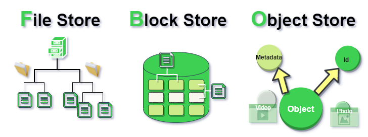

# Persistencia de Datos en IoT Industrial

## Ciclo de vida del dato

### Persistencia en Disco

- **File Storage**: Organización y almacenamiento de datos en un **disco duro** o **dispositivo conectado a la red NAS**, usando una estructura jerárquica de archivos y carpetas.

- **Block Storage**: Almacenamiento de datos en bloques dentro de **SANs** o en la nube, usado para transporte de datos rápido y fiable.

- **Object Storage**: Almacenamiento basado en objetos para manejar grandes cantidades de **datos no estructurados**, como multimedia y datos de internet.

### Comparativa entre Object, File, y Block Storage

- **File Storage**: Común para usuarios, permite compartir y establecer permisos, pero tiene escalabilidad limitada y gestión compleja para muchos archivos.

- **Block Storage**: Rápido y con baja tasa de fallos, adecuado para bases de datos y servidores, aunque tiene alto coste y falta de metadatos.

- **Object Storage**: Maneja grandes cantidades de datos no estructurados, ofrece escalabilidad y uso de metadatos, pero con rendimiento más bajo y limitaciones en la modificación de archivos.

## Big Data
- Definición y las 3 Vs (Volumen, Velocidad, Variedad) que caracterizan a los macrodatos y cómo afectan su procesamiento y análisis.

## Escalabilidad Vertical vs Horizontal
- **Vertical**: Aumenta la capacidad de un recurso, limitado por las especificaciones del hardware.

- **Horizontal**: Añade más recursos al sistema, distribuyendo la carga y favoreciendo la escalabilidad.

## Desafíos en RDBMS
- Problemas asociados con el escalado, manejo de grandes esquemas de datos, y la generación de datos temporales en bases de datos relacionales.

## NoSQL vs SQL
- Comparación de sus modelos de datos, esquemas, lenguajes de consulta, y casos de uso, destacando la escalabilidad horizontal de NoSQL frente a la vertical de SQL.

## Data Warehouse vs Data Lake
- Diferencias en tipos de datos, procesamiento, escalabilidad, coste, y casos de uso.

## Modelos de Bases de Datos
- Tipos como Clave-Valor, Documentales, Series Temporales, Grafos, y Relacional, con sus características y ejemplos específicos.

## ACID en bases de datos relacionales
- Principios de Atomicidad, Consistencia, Aislamiento y Durabilidad que aseguran la integridad y confiabilidad de las transacciones.

## Teorema de Brewer (CAP)
- Consistency, Availability, y Partition Tolerance, explicando cómo influyen en el diseño y funcionamiento de bases de datos distribuidas.
